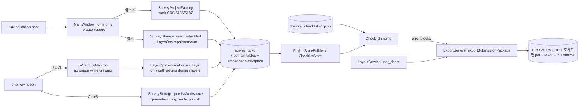
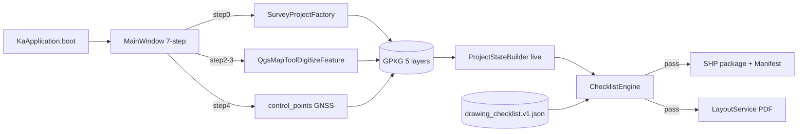

# ka-hgis data-flow graph

## Current critical path (2026-09-29)

Domain tables: `survey_area`, `feature_poly`, `feature_line`, `section_line`, `control_points`, `artifact_point`, `trial_trench` (schema: `data/schemas/ka_hgis_layers.yaml`, checked against the factory by `workflow_engine`). Reference maps (VWorld, terrain, soil, heritage) are not survey data; downloaded and VWorld cadastral layers sit at the layer-tree root.

## Historical sprint graph (production sprint, 2026-08)

> Historical sprint overview. The 7-step UI, attribute gate and initial five-layer schema describe that sprint; they are not instructions to restore those flows. For current UI, lazy legend creation, explicit saving and supported domain keys, read `AGENTS.md`, `.codex/NOW.md` and current handoffs. Follow actual callers when changing the critical path.

## Nodes
| Node | Role |
| --- | --- |
| KaApplication | QgsApplication init, prefix/PATH |
| MainWindow steps 0-6 | Beginner IA |
| SurveyProjectFactory | Create domain GPKG |
| survey_area, feature_poly, feature_line, section_line, control_points | Domain layers |
| ProjectStateBuilder | Live QJsonObject for checklist |
| ChecklistEngine | Rule eval |
| LayoutService | QgsPrintLayout + QgsLayoutExporter |
| ExportService / ShpPackage | SHP + README + MANIFEST.sha256 |

## Gaps closed by this sprint
| GAP | Node fix |
| --- | --- |
| Stub counters | ProjectStateBuilder |
| Digitize shallow | Digitize + attr gate |
| Fake PDF | LayoutService |
| Partial SHP | writeAsVectorFormatV3 package |
| Hardcode D:/qgis | rulesPath portable |

## Parallel P1
GNSS quality fields, topology/extent, hash manifest, e2e deepen
